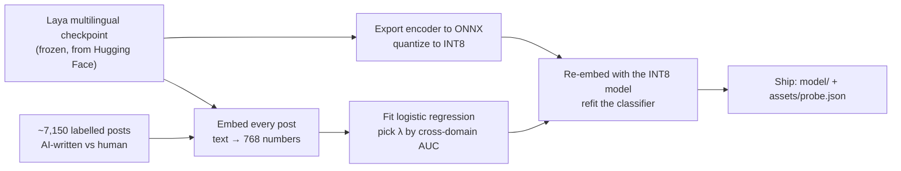
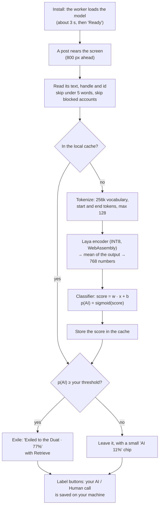

<p align="center">
  
</p>

<h1 align="center">Anubis</h1>

<p align="center"><em>Weighs every post against the feather. If it reads as machine-made, it is exiled to the Duat.</em></p>

Anubis is a browser extension for X that judges each post as it nears your screen and collapses the AI-written ones. It runs **completely offline**: the model ships inside the extension, nothing you read is sent anywhere, and there is no account, API key, or cost per post.

It is a local replacement for hosted AI-text classifiers such as TypeSafe Jev. The job is the same (score a post, hide it if it reads as machine-made), but the scoring happens on your own CPU, so there is no per-post fee, no rate limit, no outage to wait on, and no third party that ever sees your feed. It has not been benchmarked head to head against Jev; see [Accuracy](#accuracy-honestly) for what has and has not been measured.

Works in Chrome, Firefox, and Firefox-based browsers such as Zen.

## What it does

- Scores every post on your timeline and exiles the ones above your threshold into a one-line row. **Retrieve** brings a post back.
- Reads 100+ languages, not just English.
- Animated mode lets you watch the judgment: a scan line runs over each post, then it turns green and stays, or red and folds away.
- **Label** buttons (AI / Human) collect your own judgments, kept on your machine, so the classifier can be retrained on your feed.
- Blocks accounts. After three exiled posts from one account it offers to block it, and a blocked account's posts are never scored again.

## How it works

1. A content script reads each post's text (posts under five words are left alone).
2. The background worker checks a local cache (IndexedDB). On a miss it asks the model to score it.
3. The model is the [Laya](https://github.com/NandhaKishorM/laya) multilingual encoder (INT8, ONNX), run in WebAssembly by onnxruntime-web. On Chrome it lives in an offscreen document; Firefox has none, so the background page runs it.
4. A small linear classifier (768 weights, `assets/probe.json`) turns the encoder's output into a probability.

Typical cost is 100 to 200 ms per new post on a laptop CPU, then nothing for posts already seen.

## The classifier

Anubis does not use Laya's own decision heads. We train a small classifier on top of Laya's frozen encoder, which is what makes the model both accurate enough and cheap enough to run in a browser.

| | |
|---|---|
| **Encoder** | The encoder of `convaiinnovations/laya-multilingual` (mmBERT-base, from the 322M-parameter checkpoint; the decision head is not used). Frozen: its weights are never changed. |
| **Input** | The post text, tokenized with the model's 256k-token vocabulary and cut to 128 tokens. |
| **Feature** | The mean of the encoder's last hidden state over the real tokens: one 768-dimensional vector per post, from a single forward pass. |
| **Quantization** | Dynamic INT8 on the weights (ONNX Runtime), 294 MB. |
| **Classifier** | Logistic regression on that vector: `score = w · x + b`, `p(AI) = sigmoid(score)`. 768 weights and a bias, with the input standardization folded in, in `assets/probe.json`. L2-regularized (λ = 10,000, chosen by cross-domain AUC). |
| **Decision** | A post is exiled when `p(AI)` is at or above your threshold (default 75%). |
| **Speed** | About 26 ms per post on a native CPU, and 100 to 200 ms in the browser's single-threaded WebAssembly. |

**Training data** is 7,150 posts, half AI-written and half human:

- [`KirillNik/tweepfake_synthetic`](https://huggingface.co/datasets/KirillNik/tweepfake_synthetic): tweets written by an LLM against the human tweets they imitate.
- [`arjun10g/slop-paraphrase-pairs-v2`](https://huggingface.co/datasets/arjun10g/slop-paraphrase-pairs-v2): real Reddit posts against Llama-3.1-8B rewrites of them, cut to their first one to three sentences (280 characters at most) to look like tweets.

The embeddings the classifier is fitted on come from the same INT8 model that ships, so training and use match.

**Why a probe and not Laya's question heads.** Laya answers typed yes/no questions, one forward pass per question. We tried 29 zero-shot detection questions on it. They cost about 2 seconds per post and scored a cross-domain AUC of 0.61 to 0.69, with most questions no better than chance. The linear probe on the encoder scores 0.82 to 0.84 and needs one pass, which is the difference between unusable and usable on a laptop. Everything needed to reproduce it is in [training/](training/README.md).

## How Laya and the classifier work together, step 0 to the verdict

Laya supplies the understanding. It turns any text, in any of its 100+ languages, into a 768-number summary that places similar-sounding writing near each other. It was never taught what "AI-written" means. The classifier we trained is the small piece that learned which region of that space machine-written text lives in. Neither works alone: without Laya the classifier has nothing to read, and without the classifier Laya's summary is just numbers.

### Part 1: building it (done once, before it ships)



0. **Start from Laya.** Take the `laya-multilingual` checkpoint and use only its encoder. Nothing in it is retrained.
1. **Gather labelled text.** AI-written and human posts from two public datasets, with the long Reddit ones cut to tweet size.
2. **Embed.** Run every post through the encoder: tokenize, run the transformer, average the output over the tokens. Each post becomes one vector of 768 numbers (`probe_embed.py`).
3. **Fit the classifier.** Fit a logistic regression on those vectors, and choose its regularization by how well it does on the *other* dataset (`export_probe.py`). This is the only part that is trained.
4. **Shrink the encoder.** Export the encoder, with the averaging step built in, to ONNX and quantize its weights to INT8, so it fits in a browser: 294 MB and runs on a CPU.
5. **Refit on what ships.** INT8 shifts the vectors slightly, so every post is embedded again with the INT8 model and the classifier is refitted on those. The result is `assets/probe.json` (`refit_int8.py`).
6. **Bundle.** The INT8 encoder, the tokenizer and `probe.json` go into the extension, tagged with a `MODEL_VERSION` so old cached scores are never reused with a new model.

### Part 2: judging a post (every post, in your browser)



1. **Install.** The background worker starts the model. On Chrome it runs in a hidden offscreen page; Firefox has none, so the background page runs it. It reads the model, tokenizer and `probe.json` from inside the extension and reports **Ready**, usually within 3 seconds. Until then posts are left alone, and the page re-decides them the moment the model is ready.
2. **A post appears.** The page watches for tweets and starts on each one 800 pixels before it scrolls into view. It reads the id, the handle and the text. Posts under five words are skipped, and posts from accounts you blocked are hidden without being scored.
3. **Cache check.** The text is hashed with the model version and looked up in IndexedDB. A post you have scored before costs nothing, even after restarting the browser.
4. **Tokenize.** The text becomes a list of token ids using Laya's 256k-token vocabulary, wrapped in start and end tokens and cut at 128.
5. **Laya reads it.** The INT8 encoder runs once, in WebAssembly, and its output is averaged over the tokens into a single 768-number vector. This is Laya's whole contribution: a language-independent summary of how the text reads.
6. **The classifier decides.** One dot product with the 768 trained weights, plus a bias, gives a score. A sigmoid turns it into `p(AI)` between 0 and 1.
7. **Remember.** The score is stored, as a number and not as text, so the same post is never scored twice.
8. **Judge.** If `p(AI)` is at or above your threshold (default 75%), the post collapses into "Exiled to the Duat" with a **Retrieve** button. Otherwise it stays, with a small score chip. After three exiled posts from one account, Anubis offers to block the account.
9. **Close the loop.** Pressing **AI** or **Human** on a chip saves your call, with the post, on your machine. Exported labels are the data to measure how it does on your feed, and to refit the classifier on it; the scripts in `training/` currently fit on the public datasets, so using your own labels means extending them.

## Accuracy, honestly

The test that matters is training on one dataset and testing on the other, because each dataset on its own is easy to memorize. The probe reaches an AUC of **0.84** (trained on tweets, tested on Reddit rewrites) and **0.82** (the reverse). Tested within a single dataset it scores about 0.99, which says more about the datasets than about X.

What has **not** been measured: real X traffic, text from current frontier models (the training data comes from Llama-3.1-8B and a Dolphin model), and a head-to-head comparison with Jev. It will exile some people and miss some machines, and it is least reliable on very short posts. A small hand-written multilingual check (English, Spanish, French, German, Portuguese, Hindi) scored 0.99 AUC, but that set is easy and tiny. The Label buttons exist so the classifier can be refit on your own feed.

## Install

Needs Chrome 116 or newer, or Firefox 140 or newer.

1. Download the zip for your browser from the latest [release](../../releases), or build it (below).
2. Chrome: unzip it, open `chrome://extensions`, turn on Developer mode, choose **Load unpacked**, and pick the unzipped folder.
3. Firefox or Zen: open `about:debugging#/runtime/this-firefox`, choose **Load Temporary Add-on**, and pick the zip. Temporary add-ons are removed when the browser closes. A permanent install needs a signed package, or a profile that allows unsigned add-ons.
4. Open the extension's options page. It says **Ready** after a few seconds.

### Build from source

The 294 MB encoder is too large for git. It is attached to each release; to build it yourself, follow [training/README.md](training/README.md), then put `encoder.int8.onnx`, `tokenizer.json` and `tokenizer_config.json` in `model/`.

```
npm install
npm test
npm run zip:chrome     # dist/anubis-<version>-chrome.zip
npm run zip:firefox    # dist/anubis-<version>-firefox.zip
```

## Your data is safe

Your feed never leaves your computer, and you can check that rather than take it on trust:

- **No network access.** The manifest declares no host permissions, so the browser will not let the extension contact any server. There is no API, account, analytics, or telemetry.
- **The model is local.** It ships inside the extension and runs in WebAssembly on your CPU.
- **What is stored stays in your browser.** Scores are cached as numbers, not text. Your AI / Human labels, which do contain post text, leave only if you press Export.
- **Tested.** The browser test (`training/e2e.mjs`) loads the extension in Chrome and fails if its options page makes any network request.

See [PRIVACY.md](PRIVACY.md).

## Credits

- [Laya](https://github.com/NandhaKishorM/laya) by Convai Innovations, Apache-2.0 (`model/LICENSE-laya.txt`).
- [onnxruntime-web](https://github.com/microsoft/onnxruntime), MIT, and [@huggingface/tokenizers](https://github.com/huggingface/tokenizers.js), Apache-2.0 (`vendor/`).
- Fredoka font, SIL OFL 1.1 (`assets/fonts/fredoka-OFL.txt`).

## License

MIT, see [LICENSE](LICENSE).
